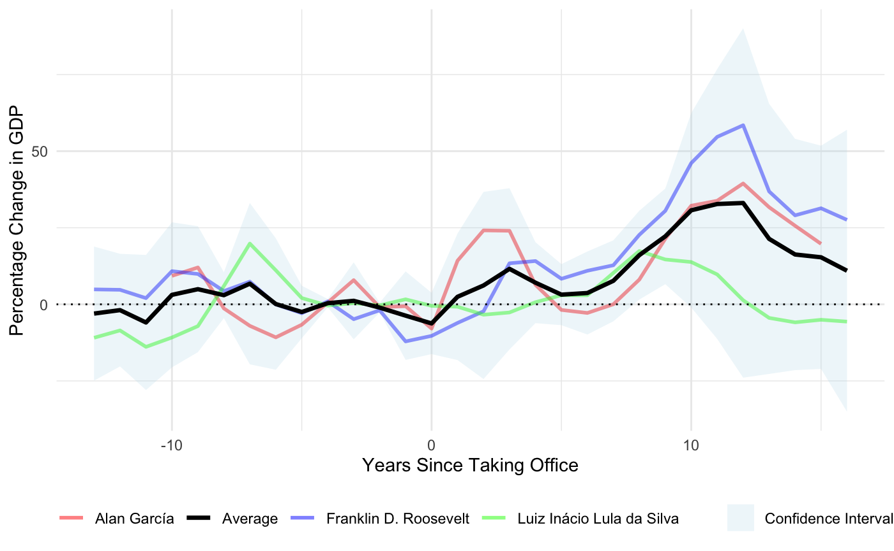
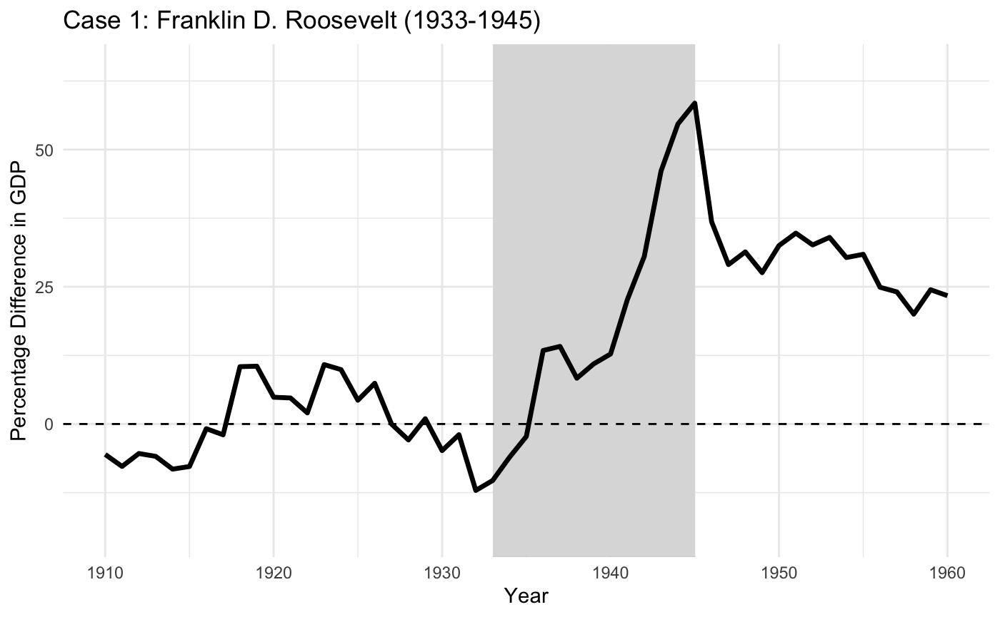
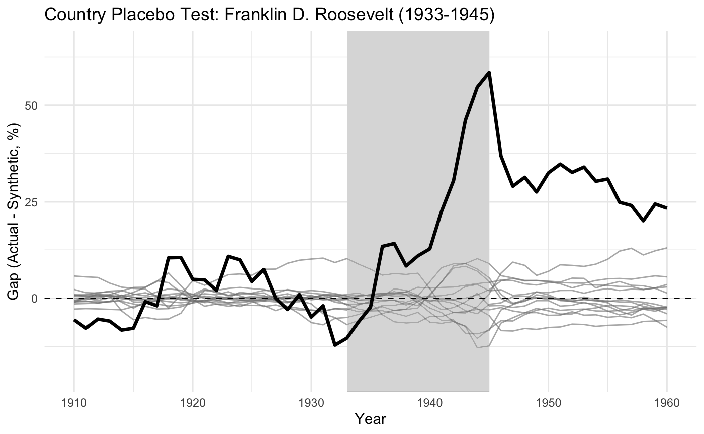
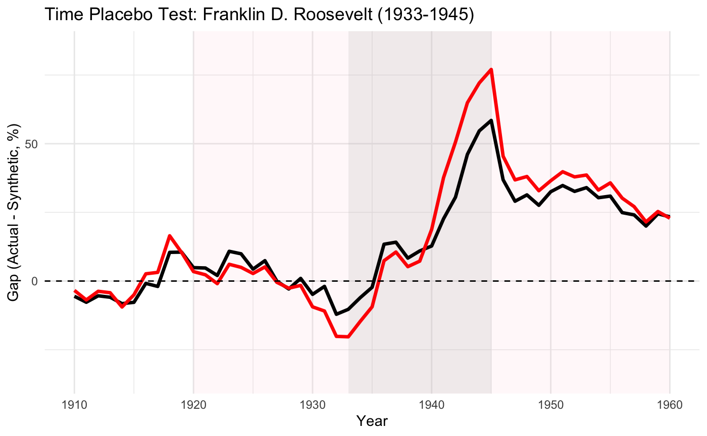

# Populists and the Economy: *Can Populism Ever Be Good Economics?*

This repository contains the materials for our empirical extension of Funke et al. (2023), investigating whether populist leadership can sometimes yield positive long-term economic outcomes. We replicate and extend their Synthetic Control Method (SCM) analysis, focusing on cases of “democratic populism,” and test if institutional checks can mitigate populism’s economic costs.

## Summary

The extension investigates whether certain populist leaders—classified as democratic populists—can generate positive long-run economic outcomes, in contrast to the general negative effects of populism found by Funke et al. (2023). Inspired by Rodrik (2018a), the motivation is to explore whether populism, when paired with strong democratic institutions, can lift policy constraints and foster economic growth. This idea is tested using historical cases such as Franklin D. Roosevelt (FDR), Alan García, and Luiz Inácio Lula da Silva.

  

  
The figure above shows the average GDP gap between treated countries and their synthetic controls. While results for FDR confirm robust post-treatment performance, the method fails to produce credible synthetic controls for Lula and García due to poor pre-treatment fit. This highlights limitations in the donor pool and underscores the difficulty of evaluating populist regimes in Latin America using existing cross-country data. 

  

This figure shows the GDP gap between the US and its synthetic control. While FDR shows a clear positive deviation from his synthetic counterfactual, the cases of Lula and García do not yield valid inferences due to poor pre-treatment fit. This suggests that synthetic control may be less effective in contexts where country-specific shocks or limited donor pools constrain the construction of credible counterfactuals. We also find that the results on the case of FDR are robust to country-placebo and time-placebo falsification exercises. 

  

    
    
  

## Contents

- `Populists_leaders.pdf`: Final paper and results
- `PLE_extension_final.Rmd`: Full R Markdown code for extension
- `PLE_extension_final.html`: Rendered HTML version of the code for extention
- `Replication`: All datasets, scripts and outputs of the replication
- `Extension`: All datasets(V-Dem, PWT, JST, crises), scripts and figures used in the extension 

## Authors

Michele Andreoni, Marta Cacopardo, Moritz Dassel, Javier Ospital

## References

Funke, M., Schularick, M., & Trebesch, C. (2023). Populist leaders and the economy. American Economic Review, 113(12), 3249–3288. 

Rodrik, D. (2018a). Is populism necessarily bad economics? AEA Papers and Proceedings, 108, 196–199. 

